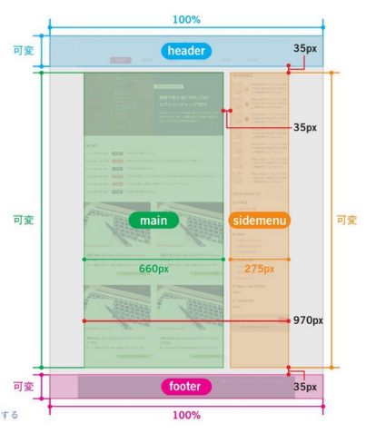

# HTML5CSS3モダンコーディング

## コーディングのポイント
- 要素名にスタイルを指定しない
    - a, input, textareaのような機能的な要素は例外
- CSSのセレクタにはIDではなくクラスを使用
    - スタイルの使い回しが出来ない
    - スタイルの上書きが難しい(IDはクラスよりも詳細度が高い)
    - HTML, JSからはID指定、影響範囲を分離
- リセットCSS、ノーマライズCSS(UAスタイルシートの装飾をできるだけ活かしながらブラウザ間の差異を埋める)
    - UAスタイルシートを活かせそうなサイトデザインならノーマライズCSSのようが効率が良い

## スタンダードレイアウト
- ヘッダー
    - サイトロゴ
    - ナビゲーションメニュー
- メイン
    - 特集コンテンツ
    - 更新履歴
    - 記事ブロック
- サイドメニュー
    - ランキング
    - ドキュメントリスト
    - 検索ボックス
- フッター
    - フッターメニュー
    - コピーライト



[visual studio code emmet Cheat Sheet](http://docs.emmet.io/cheat-sheet/ "Cheat Sheet")

- main要素は1ページ内で1回。header、footerは制限なし
- clearfix
  - 親の下に子がいる状況で、子にfloat指定したら、親にclearfix用のクラス指定
  ```css
  .clearfix::after{
    content: '';
    display: block;
    clear: both;
  }
  ```
- em...親要素のfont-sizeを1とした倍率
- rem...ルート要素(html要素)のfont-sizeを1とした倍率
  - html要素のfont-sizeは%指定が一般的。主要なブラウザのデフォルトフォントサイズは16pxなので、62.5%を指定して10px相当にする。
- ボックスモデル
  - widthプロパティとheightプロパティで指定する要素の大きさは通常、コンテンツエリアだが、box-sizingプロパティで変更可能


- box-shadow
```
box-shadow: [右方向のずれ] [下方向のずれ] [ぼかしの大きさ] [拡張の大きさ] [影の色];
```
  - insetキーワードで内側に影
  ```
  box-shadow: inset [右方向のずれ] [下方向のずれ] [ぼかしの大きさ] [拡張の大きさ] [影の色];
  ```
  - カンマ区切りで複数の影
- サイトロゴ
  - 画像をimg要素で表示してその要素のalt属性の中にテキストを書く方法
  - テキストは見えない形で記述し、画像は背景画像として表示
      - `text-indent: 100%;`で要素の幅の分だけインデントし、`white-space: nowrap;`で折り返さずに要素外に押し出し、`overflow: hidden;`ではみ出した分を隠す
- 親要素と最初の子要素の間に余白をとりたい場合は、親要素にpadding-topを指定する
  - 子要素にmargin-topを指定すると、マージンの相殺によって上に突き出る
- line-height
  - 例えばline-heightが20pxでfont-sizeが14pxの場合、 20px（行の高さ）から14px（フォントサイズ）を引いた残りの6pxが、行間として上下均等に3pxずつ割り振られます。 
  - line-heightとheightを同じにするとテキストを縦方向の中央寄せにできる
  - 倍率を指定する時は単位を書かないのがベター`line-height:1.5;`
- letter-spacing
  - 文字と文字の間隔を指定
- transition
  - `transition: property duration timing-function delay;`